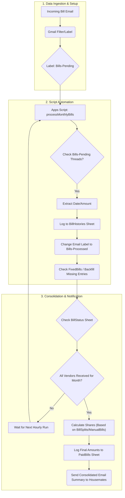

# Utility Splitter

A web application for tracking and splitting monthly utility bills among housemates. Built with React, TypeScript and Vite.

## Use Case


## Pre-requisites (Google Apps Script Setup)

Before you can fully utilize the application's backend functionalities, you need to set up the Google Apps Script as detailed in the [`gAppScripts/Readme.md`](gAppScripts/Readme.md) file. This involves configuring the script to interact with your Google Sheets for data storage and processing.

### 2. Setup Service Account

To enable persistent login, you need to create a Google Service Account.

1.  **Create Service Account:**
    *   Go to the [Google Cloud Console](https://console.cloud.google.com/).
    *   Select your project.
    *   Navigate to **IAM & Admin** > **Service Accounts**.
    *   Click **Create Service Account**.
    *   Name it (e.g., `utility-app`) and click **Create and Continue**.

2.  **Generate Key:**
    *   Click on the newly created service account (email address).
    *   Go to the **Keys** tab.
    *   Click **Add Key** > **Create new key**.
    *   Select **JSON** and click **Create**.
    *   The key file will download to your computer.

3.  **Share Sheet (Crucial):**
    *   Copy the **email address** of the service account (e.g., `utility-app@project-id.iam.gserviceaccount.com`).
    *   Open your Google Sheet.
    *   Click **Share** and paste the email address.
    *   **Permission:** You must grant **Editor** access.
        *   *Why?* The app needs to **write** data to your sheet (adding bills, updating splits, and saving the AppConfig key). If you only grant "Viewer", the app will not work.

4.  **Configure App:**
    *   Log in to the app with Google.
    *   Follow the prompt to check the `AppConfig` sheet.
    *   Open the downloaded JSON key file with a text editor, copy the entire content, and paste it into cell **A2** of the `AppConfig` sheet.
    *   Set a PIN in the app to secure your session.

# Known issues


# Future Improvements
- Warning for any sorts of bills that are added after a november bill are fully processed, by checking BillStatus Sheet
- On initial load, only load a maximum of 10 years, while periodic sync only sync the current month, unless a manual sync is triggered
- Track payment status from housemate, how much is owed
- Automatically tracks payment when a housemate makes a payment
    - track by bill + rent, or bill, rent separately from housemate name
    - across different banks paynow email template, UOB DBS and OCBC
- Automatically sends reminder email when a housemate did not pay


## Prerequisites

-   [Node.js](https://nodejs.org/) (v18+)
-   [Docker](https://www.docker.com/)
-   [Fly CLI](https://fly.io/docs/hands-on/install-flyctl/)


## Local Development

To run the application locally with hot-reloading:

1.  **Install Dependencies**:
    ```bash
    npm install
    ```

2.  **Start the Frontend**:
    ```bash
    npm run dev
    ```
    Access the app at `http://localhost:5173`.

## Build & Run Locally (Docker)

To verify the production build locally using Docker:

1.  **Build the Image**:
    ```bash
    docker build -t utility-splitter:local -f Dockerfile .
    ```

2.  **Run the Container**:
    ```bash
    docker run -p 3000:80 utility-splitter:local
    ```
    Access the app at `http://localhost:3000`.

## Deployment

We use a single-container deployment strategy on Fly.io, pulling the image from Docker Hub.

### 1. Build and Push to Docker Hub

Replace `your-username` with your Docker Hub username.

#### Option 1: run deploy.ps1

```bash
powershell -ExecutionPolicy Bypass -File .\deploy.ps1
```

#### Option 2: run commands manually

```bash
# Build the image
docker build -t your-username/utility-splitter:latest -f Dockerfile.fly .

# Push to Docker Hub
docker push your-username/utility-splitter:latest
```

### 2. Deploy to Fly.io

1.  **Create the App** (first time only):
    ```bash
    fly apps create utility-splitter
    ```

2.  **Deploy**:
    ```bash
    fly deploy --image your-username/utility-splitter:latest
    ```
